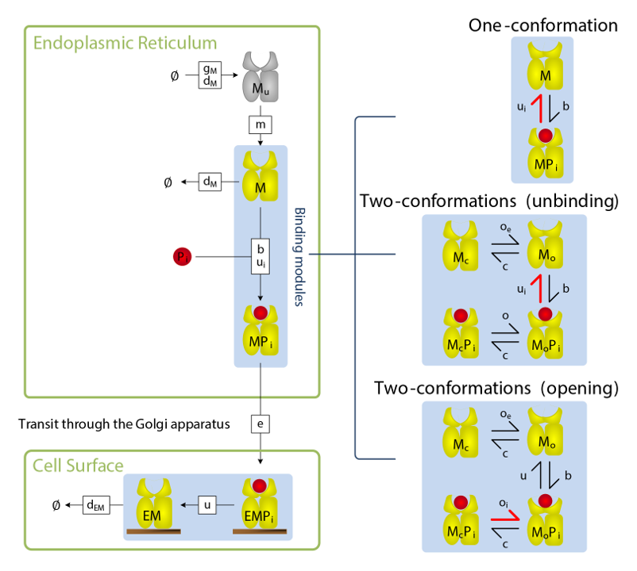
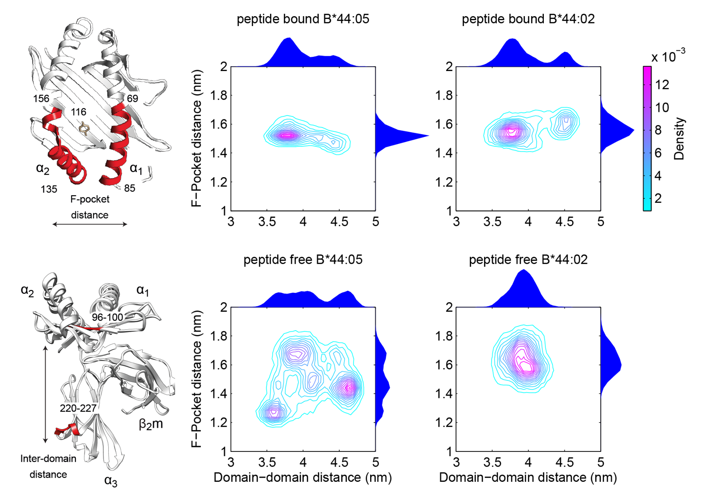

This project sought to explain the mechanism of peptide selection by two functionally distinct MHC I allotypes using a combination of molecular dynamics and mathematical modelling of biochemical experiments.

In collaboration with [the Biological Computation Group at Microsoft Research Cambridge](https://www.microsoft.com/en-us/research/group/biological-computation/) 
we used biochemical data to infer that a conformational intermediate of MHC I is 
significant for peptide selection, and molecular dynamics simulations to show that peptide selector function correlates with protein plasticity.

This led to the proposal that MHC I cofactor tapasin modulates MHC I plasticity by 
dynamically coupling the peptide binding region and membrane bound domain.

## Publication

A. Bailey, N. Dalchau, R. Carter, S. Emmott, A. Phillips, J. M. Werner, T. Elliott. 
Selector function of MHC I molecules is determined by protein plasticity. 
Sci Rep, (5), pp. 14928, https://doi.org/10.1038/srep14928, 2015. 

